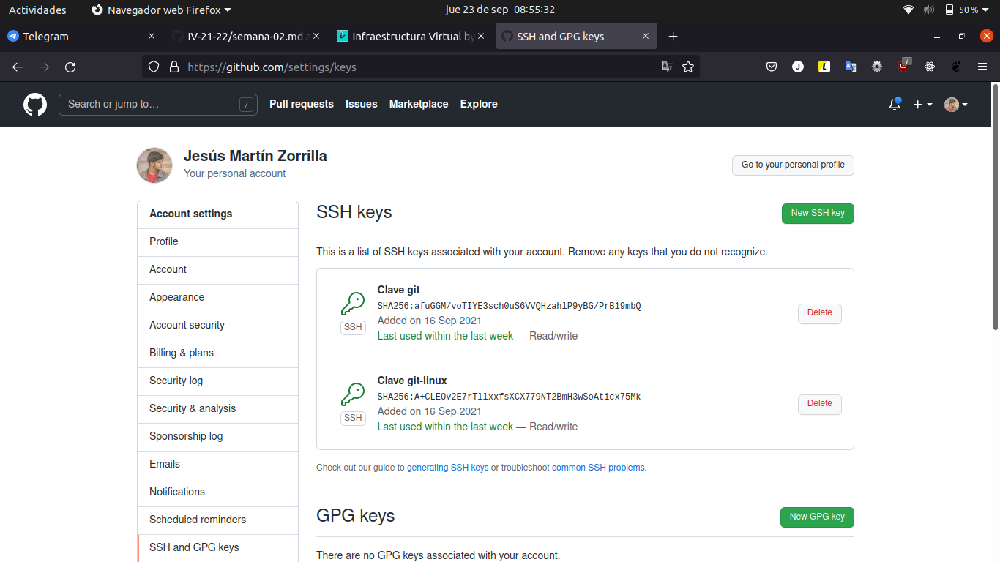

# Documentación adicional del proyecto
## Configuración git y github
### Creación de par de claves y subida de clave pública a GitHub
Creamos las claves con el comando ssh-keygen.

Como vemos, se nos crearon las claves git en el directorio "~/.ssh".

Para configurar estas claves, vas a la configuración de github al apartado de "SSH and GPG keys" y añades la clave pública generada anteriormente.

### Configuración correcta del nombre y correo electrónico para que aparezca en los commits correctamente

Configurar nombre.

Configurar email.

### Edición del perfil en GitHub para que aparezca nombre completo y ciudad, así como universidad e imagen del avatar que no sea la imagen por omisión

Puedes editarlo en el perfil de Github.

